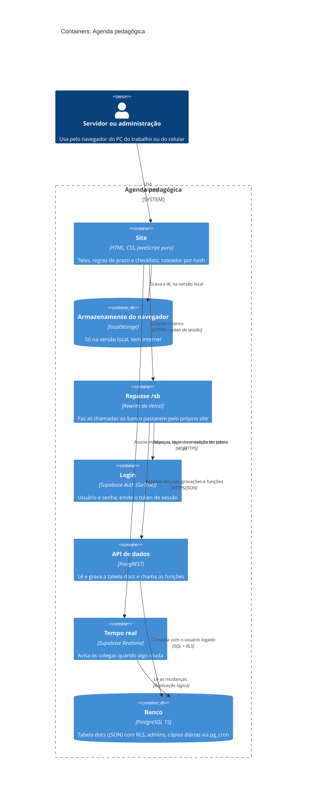

# Nível 2: Containers

As partes que rodam separadas. O site é um só conjunto de arquivos estáticos que funciona de dois jeitos:

- **versão da equipe**, publicada na internet, com os dados no Supabase;
- **versão local**, aberta pelo arquivo, com os dados no navegador.

## Dentro do site (componentes principais)

Todos os arquivos ficam em `js/` e compartilham um único objeto global, `window.App`. Eles são carregados nesta ordem pelo `index.html`:

| Arquivo | Papel |
|---|---|
| `util.js` | Funções gerais: datas, escape de HTML, avisos, ícones |
| `dados.js` | Modelo: processos, prazos, situação, encaminhamentos, migração de formatos antigos |
| `regras.js` | Modelos de checklist por tipo de processo e a tela Regras de prazo |
| `entrada.js` | Perfis e escolha de painel |
| `painel.js`, `processos.js`, `processo.js` | Telas principais |
| `agenda.js` | Agenda da equipe, salas, impressão da semana |
| `relatorio.js` | Exportação em planilha (SheetJS) |
| `equipe.js` | Tela da administração: contas, senhas, salas, cópias |
| `avisos.js` | Sino de avisos (atrasos, respostas pendentes, certificados) |
| `supabase-db.js` | Adaptador do banco: login, leitura, gravação, tempo real e plano B por consulta periódica |
| `nuvem.js` | Sincroniza o estado da tela com o banco (só grava o que mudou) |
| `app.js` | Inicialização e roteamento |

**Onde está a segurança:** no banco. Conta nova não lê nem grava nada até a administração liberar (tabela `liberados`). O site esconde botões que a pessoa não pode usar, mas quem decide é o PostgreSQL, pelas políticas RLS e pelas funções `security definer` que conferem `sou_admin()` ou `sou_principal()`.
