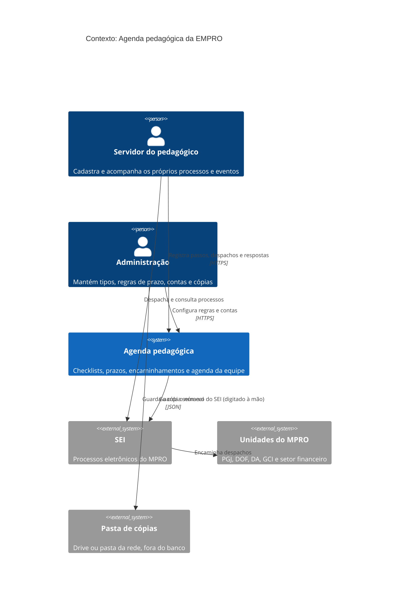

# Nível 1: Contexto

Quem usa o sistema e com o que ele se relaciona. Hoje nenhuma ligação com outros sistemas é automática: o número do SEI é digitado à mão e as cópias de segurança são baixadas e guardadas pela administração.

**Fronteira do sistema:** a Agenda não substitui o SEI. Ela organiza o trabalho do pedagógico **em volta** do SEI: o que precisa ser feito, até quando, e o que está parado esperando outra unidade.
