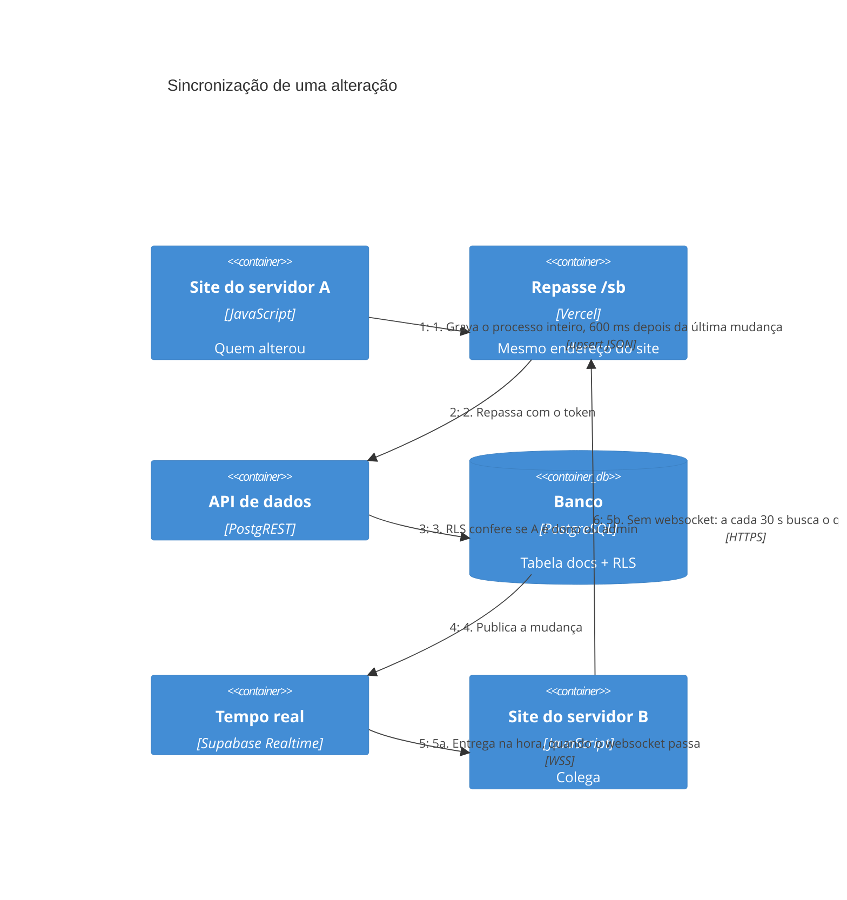

# Fluxo: como uma alteração chega aos colegas

Exemplo: um servidor marca um passo como feito.

## Pontos de atenção do fluxo atual

- **A gravação é do documento inteiro.** Se duas pessoas mexerem no mesmo processo dentro da mesma janela, vale a última gravação, e a outra mudança se perde sem aviso. Na rede do MP essa janela é de até 30 segundos.
- **Plano B leve.** Sem websocket, a consulta a cada 30 s traz só os documentos mais novos que a última alteração vista (coluna `atualizado`). A cada 5 voltas, uma conferência só de ids e horários acha o que foi apagado ou escapou. A leitura é feita de mil em mil linhas, o limite da API. Para quando a aba fica escondida.
- **Comparação estável.** O site compara o JSON com as chaves em ordem para não regravar o que não mudou (`nuvem.js`).
