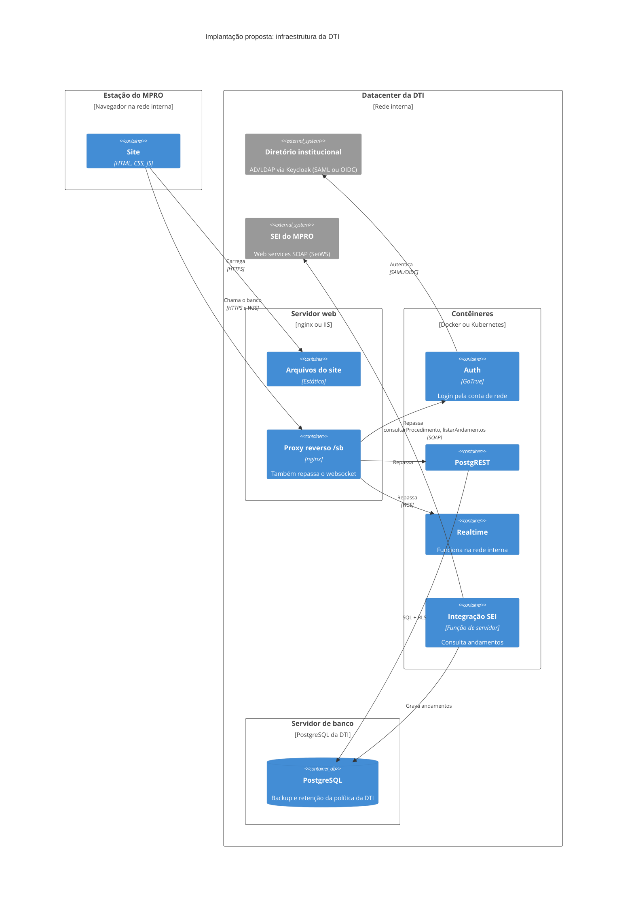

# Implantação proposta na DTI

**Proposta:** levar o mesmo código para servidores da DTI, sem reescrever o site.
- O Supabase é software livre: dá para rodar Auth, PostgREST e Realtime em contêineres dentro da rede, apontando para um PostgreSQL da DTI.
- O site só troca o endereço do banco: hoje ele está fixo em `js/supabase-db.js`.

## O que muda em relação a hoje

| Hoje | Na DTI |
|---|---|
| Senha própria do sistema | Login com a conta de rede: quem sai do MPRO perde o acesso sozinho |
| Websocket bloqueado, consulta a cada 30 s | Tempo real funcionando na rede interna |
| Número do SEI digitado; despacho e resposta marcados à mão | O sistema consulta o SEI e mostra o andamento. A DTI precisa cadastrar o sistema no SEI. |
| Cópia diária no próprio banco + download manual | Backup e retenção da DTI |
| Dados em nuvem pública, fora do MPRO | Dados no datacenter do MPRO |

Se a DTI tiver uma plataforma padrão própria (Java, .NET ou PHP), outro caminho é **reescrever** nessa plataforma usando o protótipo como especificação viva. As telas, as regras de prazo e o [modelo de dados proposto](modelo-de-dados.md) já descrevem o que o sistema faz.
