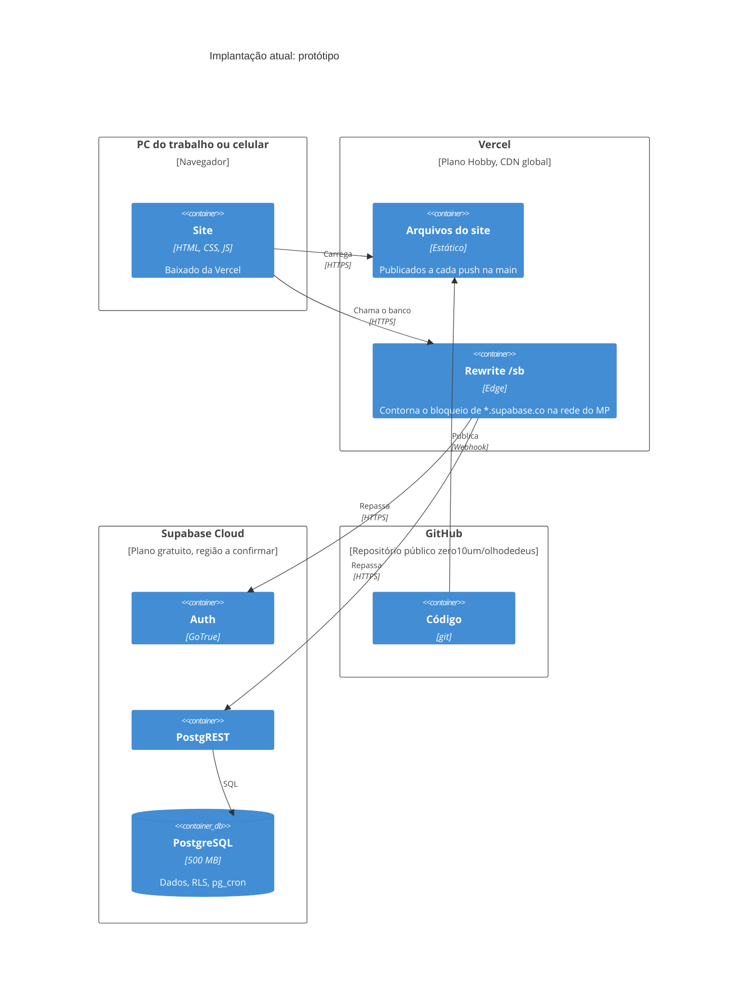

# Implantação atual (protótipo)

Tudo em serviços gratuitos, fora da infraestrutura do MPRO.

## Limites que valem para um protótipo, mas não para produção

| Serviço | Limite |
|---|---|
| Supabase gratuito | Pausa o projeto depois de 7 dias sem uso (o recesso de fim de ano passa disso); 500 MB de banco; 5 GB de tráfego por mês; sem backup gerenciado (por isso existe a cópia diária própria) |
| Vercel Hobby | Destinado a uso pessoal e não comercial; o tráfego para o banco também passa por ela |
| Os dois | Contas pessoais, fora da gestão da DTI; dados fora da rede do MPRO |
