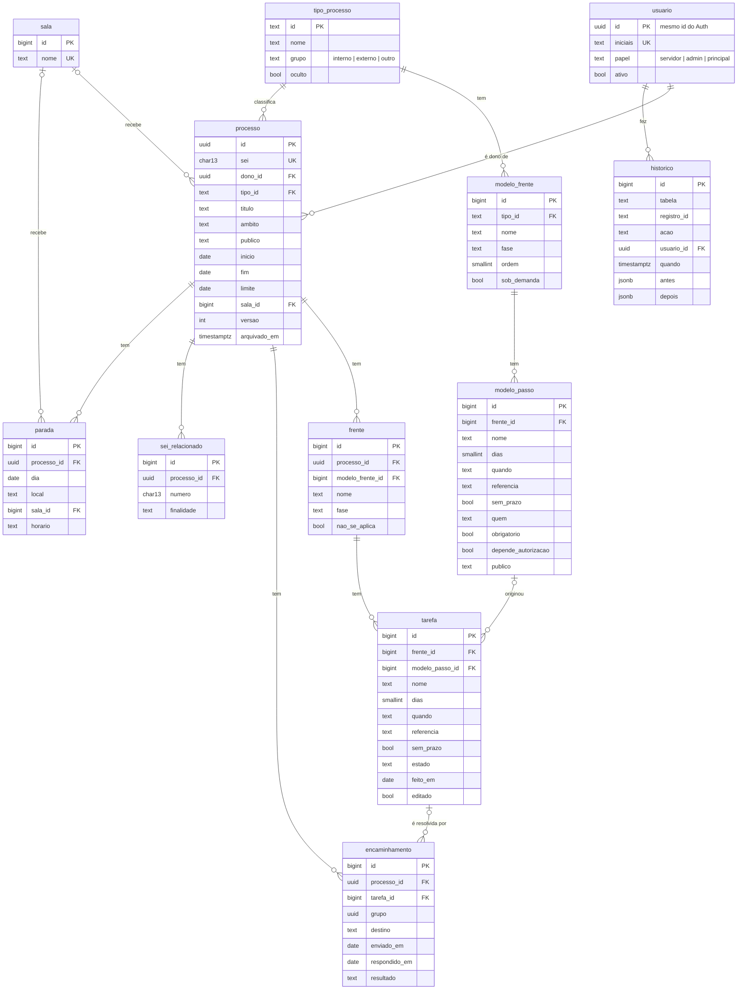

# Modelo de dados

## Como está hoje

Uma tabela guarda tudo: cada linha é um documento JSON (`jsonb`). O esquema completo está em `supabase/esquema.sql`; as mudanças mais recentes, em `supabase/atualizar-banco.sql`.

| Tabela | Conteúdo |
|---|---|
| `docs (col, id, dono, dados jsonb, atualizado)` | Documentos: `perfis`, `regras`, `leituras`, `processos`, `prefs`, `equipe` |
| `admins (user_id, principal)` | Quem é administração; `principal` apaga contas |
| `liberados (user_id, liberado_em, liberado_por)` | Contas que a administração liberou; sem isso, a conta não lê nem grava |
| `copias (id, feita_em, itens, dados jsonb)` | Retrato diário de `docs` (fica com os 30 últimos) |

O documento de um processo (de 3 KB a 8 KB) carrega tudo dentro dele:

```text
processo
├─ sei, titulo, tipoId, dono, ambito, publico, inicio, fim, limite, horario, local, arquivado
├─ frentes[]            grupos do checklist (Início, Contratação, Comunicação…)
│   └─ itens[]          passos: nome, regra {dias, quando, ref, semPrazo}, estado, quem, obrig, depAut, para, na
├─ despachos[]          encaminhamentos: setor, grupo, enviado, resposta, resultado, nota
├─ seis[]               SEIs relacionados
├─ roteiro[]            paradas de um evento em vários lugares
└─ diario[]             histórico: data, tipo, texto, autor
```

**Por que funcionou bem no protótipo:** dava para mudar o formato toda semana sem migração de banco, e a segurança por linha (RLS) ficou simples: o dono do processo é a coluna `dono`.

**O que pesa para produção:**

- **Relatórios e BI:** "quantos encaminhamentos à PGJ demoraram mais de 15 dias" exige abrir o JSON de cada processo.
- **Integridade:** o banco não confere tipos, datas nem relações. Isso é feito só pelo site.
- **Concorrência:** a menor unidade de gravação é o processo inteiro.
- **Auditoria:** o `diario` fica dentro do documento que o próprio usuário edita. Não serve como trilha de auditoria.

## Modelo relacional proposto



### DDL (PostgreSQL 15)

```sql
create type papel_t     as enum ('servidor', 'admin', 'principal');
create type estado_t    as enum ('aberta', 'esperando', 'feita');
create type resultado_t as enum ('autorizado', 'indeferido', 'ciencia');
create type publico_t   as enum ('membros', 'ambos', 'servidores');

create table usuario (
  id        uuid primary key references auth.users (id) on delete restrict,
  iniciais  text not null unique check (iniciais ~ '^[A-Z.]{2,12}$'),
  papel     papel_t not null default 'servidor',
  ativo     boolean not null default true,
  criado_em timestamptz not null default now()
);

create table tipo_processo (
  id     text primary key,
  nome   text not null,
  grupo  text not null check (grupo in ('interno', 'externo', 'outro')),
  oculto boolean not null default false
);

create table modelo_frente (
  id          bigint generated always as identity primary key,
  tipo_id     text not null references tipo_processo (id) on delete cascade,
  nome        text not null,
  fase        text not null check (fase in ('inicio', 'prep', 'evento', 'pos', 'fim')),
  ordem       smallint not null,
  sob_demanda boolean not null default false,
  unique (tipo_id, ordem)
);

create table modelo_passo (
  id                  bigint generated always as identity primary key,
  frente_id           bigint not null references modelo_frente (id) on delete cascade,
  nome                text not null,
  dias                smallint not null default 0 check (dias between 0 and 365),
  quando              text not null check (quando in ('antes', 'depois')),
  referencia          text not null check (referencia in ('entrada', 'inicio', 'fim', 'limite')),
  sem_prazo           boolean not null default false,
  quem                text not null default 'faz' check (quem in ('faz', 'acompanha')),
  obrigatorio         boolean not null default false,
  depende_autorizacao boolean not null default false,
  publico             publico_t,
  ordem               smallint not null
);
create index on modelo_passo (frente_id);

create table sala (
  id   bigint generated always as identity primary key,
  nome text not null unique
);

create table processo (
  id           uuid primary key default gen_random_uuid(),
  sei          char(13) unique check (sei ~ '^\d{5}/\d{4}-\d{2}$'),
  dono_id      uuid not null references usuario (id) on delete restrict,
  tipo_id      text not null references tipo_processo (id),
  titulo       text not null check (length(titulo) <= 300),
  ambito       text check (ambito in ('interno', 'externo')),
  publico      publico_t,
  entrada      date not null default current_date,
  inicio       date,
  fim          date,
  limite       date,
  horario      text,
  sala_id      bigint references sala (id) on delete set null,
  local        text,
  observacoes  text,
  versao       int not null default 1,          -- controle de edição simultânea
  arquivado_em timestamptz,
  criado_em    timestamptz not null default now(),
  atualizado   timestamptz not null default now(),
  check (fim is null or inicio is null or fim >= inicio)
);
create index on processo (dono_id);
create index on processo (inicio) where arquivado_em is null;

create table frente (
  id               bigint generated always as identity primary key,
  processo_id      uuid not null references processo (id) on delete cascade,
  modelo_frente_id bigint references modelo_frente (id) on delete set null,
  nome             text not null,
  fase             text not null,
  nao_se_aplica    boolean not null default false
);
create index on frente (processo_id);

create table tarefa (
  id              bigint generated always as identity primary key,
  frente_id       bigint not null references frente (id) on delete cascade,
  modelo_passo_id bigint references modelo_passo (id) on delete set null,
  nome            text not null,
  dias            smallint not null default 0,
  quando          text not null default 'antes',
  referencia      text not null default 'inicio',
  sem_prazo       boolean not null default false,
  quem            text not null default 'faz',
  obrigatorio     boolean not null default false,
  estado          estado_t not null default 'aberta',
  feito_em        date,
  editado         boolean not null default false,  -- mexido à mão: as Regras de prazo não sobrescrevem
  nao_se_aplica   boolean not null default false
);
create index on tarefa (frente_id);
create index on tarefa (estado) where estado <> 'feita';

create table encaminhamento (
  id            bigint generated always as identity primary key,
  processo_id   uuid not null references processo (id) on delete cascade,
  tarefa_id     bigint references tarefa (id) on delete set null,
  grupo         uuid not null,                  -- o mesmo despacho a vários destinos
  destino       text not null,
  texto         text,
  enviado_em    date not null,
  respondido_em date,
  resultado     resultado_t,
  nota          text,
  check ((respondido_em is null) = (resultado is null))
);
create index on encaminhamento (processo_id);
create index on encaminhamento (destino) where respondido_em is null;

create table sei_relacionado (
  id          bigint generated always as identity primary key,
  processo_id uuid not null references processo (id) on delete cascade,
  numero      char(13) not null check (numero ~ '^\d{5}/\d{4}-\d{2}$'),
  finalidade  text,
  unique (processo_id, numero)
);

create table parada (
  id          bigint generated always as identity primary key,
  processo_id uuid not null references processo (id) on delete cascade,
  dia         date not null,
  local       text,
  sala_id     bigint references sala (id) on delete set null,
  horario     text,
  preparar    text
);
create index on parada (processo_id);

-- Trilha de auditoria: só o banco escreve (trigger), ninguém edita nem apaga
create table historico (
  id          bigint generated always as identity primary key,
  tabela      text not null,
  registro_id text not null,
  acao        text not null check (acao in ('insert', 'update', 'delete')),
  usuario_id  uuid,
  quando      timestamptz not null default now(),
  antes       jsonb,
  depois      jsonb
);
create index on historico (tabela, registro_id);
revoke insert, update, delete on historico from authenticated;

-- Preferências de tela continuam em JSON: não precisam de relatório
create table preferencia (
  usuario_id uuid primary key references usuario (id) on delete cascade,
  dados      jsonb not null default '{}'
);
```

### Segurança por linha no modelo novo

A regra continua a mesma de hoje:
- todo usuário **ativo** lê;
- cada um grava só o que é seu;
- a administração grava tudo.

Exemplo para `processo` (as tabelas filhas seguem o `dono_id` do processo pai):

```sql
alter table processo enable row level security;
create policy le on processo for select to authenticated
  using (exists (select 1 from usuario u where u.id = auth.uid() and u.ativo));
create policy grava on processo for all to authenticated
  using (dono_id = auth.uid() or (select papel from usuario where id = auth.uid()) in ('admin', 'principal'))
  with check (dono_id = auth.uid() or (select papel from usuario where id = auth.uid()) in ('admin', 'principal'));
```

### Edição simultânea

O site manda a `versao` que leu. A gravação só acontece se ninguém gravou no meio. Se `0 linhas` voltar, o site busca a versão nova e avisa: "Fulano mexeu neste processo agora há pouco".

```sql
update processo set titulo = $1, versao = versao + 1, atualizado = now()
 where id = $2 and versao = $3;
```

### Migração dos dados atuais

Os documentos de hoje podem ser lidos direto em SQL, sem exportar nada. Por exemplo:

```sql
-- os ids de hoje ("p" + texto aleatório) não são UUID: ficam guardados em id_antigo
alter table processo add column id_antigo text unique;

insert into processo (id_antigo, sei, dono_id, tipo_id, titulo, inicio, fim)
select dados->>'id', nullif(dados->>'sei', ''), dono, dados->>'tipoId', dados->>'titulo',
       nullif(dados->>'inicio', '')::date, nullif(dados->>'fim', '')::date
from docs where col = 'processos';
```

Frentes, itens e despachos saem do mesmo jeito, com `jsonb_array_elements(dados->'frentes')`, ligados pelo `id_antigo`. Antes, os tipos antigos que só existem nos processos precisam entrar em `tipo_processo`.
